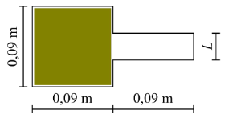

# Difusión de un gas en 2D

En este trabajo se explorará el movimiento browniando de las partículas
de un gas que dan lugar a la difusión del mismo. Consideraremos que las
partículas son indistinguibles, teniendo estas la misma masa y el mismo
radio, pero distinta dirección y ubicación inicial dentro del dominio
establecido.

<figure style="text-align: center; max-width: 100%">
    
    <figcaption>Fig. 1: Dominion en el que se trabajará, siendo L variable
y las demás longitudes fijas</figcaption>
</figure>

## Ejecución
Se debe ejecutar primero la generación de las partículas en el dominio.
Utilizamos el comando:

```bash
python ./scripts/static_generator.py
```

Una vez generados los archivos tanto estáticos como dinámicos para la
simulación, podemos ejecutar el main de la clase `Simulation` para
generar el output primario de la misma. Ahí obtendremos un archivo cuyo
formato ya estará listo para que [Ovito](https://www.ovito.org/windows-downloads/)
lo interprete correctamente.